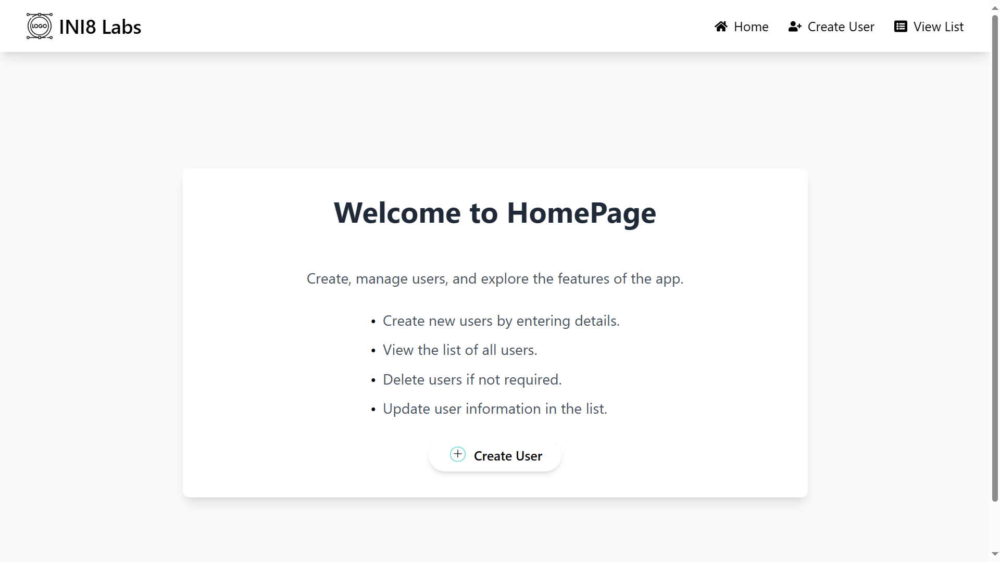

# User Registration Application
## (if databse key is  not working[firebaseServiceAccountKey.json](user-registration-backend/firebaseServiceAccountKey.json)  create your database and generate new private key  or... request for api key (only for testing))
This is a full-stack application built using **React.js** for the frontend and **Node.js** with **Express** for the backend. The application allows users to interact with Firebase Realtime Database, perform CRUD operations, and view or update data through a responsive user interface.

## Table of Contents
- [Project Overview](#project-overview)
- [Screenshots](#Scrennshots)
- [Technologies Used](#technologies-used)
- [Frontend Setup](#frontend-setup)
- [Backend Setup](#backend-setup)
- [Running the Application](#running-the-application)
- [API Endpoints](#api-endpoints)
- [Firebase Setup](#firebase-setup)

## Project Overview
This full-stack application allows users to perform CRUD (Create, Read, Update, Delete) operations. The backend handles the logic, user authentication, and serves API requests, while the frontend displays the data in an interactive, user-friendly manner. 

The application uses **Firebase Realtime Database** for storing data and **JWT Authentication** for secure access control.

## Screenshots

Here are some screenshots of the application in action:

### Home




### Cretae User


### View User 


## Technologies Used

### Frontend
- **React.js**: JavaScript library for building user interfaces.
- **Tailwind CSS**: A utility-first CSS framework for fast UI development.
- **Axios**: Promise-based HTTP client for making API requests.
- **React Router**: For navigation between components.

### Backend
- **Node.js**: JavaScript runtime for building the backend server.
- **Express.js**: Web framework for Node.js to build RESTful APIs.
- **Firebase Realtime Database**: NoSQL database for storing data.
- **JWT (JSON Web Token)**: For secure user authentication.

### Tools and Libraries
- **Nodemon**: Tool for auto-reloading the server during development.
- **Cors**: Middleware to enable Cross-Origin Resource Sharing (CORS).
- **dotenv**: For managing environment variables.
- **bcryptjs**: Library for password hashing.
- **jsonwebtoken**: To generate JWT tokens for authentication.

## Frontend Setup

1. **Install dependencies**:
   - Ensure that you have **Node.js** and **npm** installed. If not, download and install from [Node.js official website](https://nodejs.org/).
   - Inside the `frontend` directory, run:
     ```bash
     npm install
     ```

2. **Run the development server**:
   - After installing the dependencies, you can start the React development server by running:
     ```bash
     npm start
     ```
   - This will open the application in your default browser, usually at `http://localhost:3000`.


## Backend Setup

1. **Install dependencies**:
   - Ensure that you have **Node.js** and **npm** installed.
   - Inside the `backend` directory, run:
     ```bash
     npm install
     ```

2. **Set up environment variables**:
   - Create a `.env` file inside the `backend` folder and add your configuration. Example:
     ```bash
     PORT=5000
     FIREBASE_API_KEY=your_firebase_api_key
     JWT_SECRET=mysecretkey
     ```

3. **Run the development server**:
   - Start the server using **Nodemon** (for automatic reloading):
     ```bash
    node server.js
     ```
   - The server will run on `http://localhost:5000`.

## Running the Application

### Steps to Run Both Frontend and Backend

1. Open two terminal windows or tabs.

2. **In the first terminal**:
   - Navigate to the `frontend` folder and run:
     ```bash
     npm start
     ```

3. **In the second terminal**:
   - Navigate to the `backend` folder and run:
     ```bash
     node server.js
     ```

4. Now, the frontend should be accessible on `http://localhost:3000`, and the backend will be running on `http://localhost:5000`.

### Full Application Flow
- **Frontend**: The React app communicates with the backend through API calls (using Axios).
- **Backend**: The Express server handles API requests, authenticates users, and interacts with Firebase Realtime Database to perform CRUD operations.
- **Database**: Firebase Realtime Database stores user and application data.


## API Endpoints

### User Endpoints

- **GET `/api/users`**: Get all users.
- **GET `/api/users/:id`**: Get a specific user by ID.
- **POST `/api/users`**: Create a new user.
- **PUT `/api/users/:id`**: Update an existing user.
- **DELETE `/api/users/:id`**: Delete a user by ID.

### Authentication Endpoints

- **POST `/api/auth/register`**: Register a new user.
- **POST `/api/auth/login`**: Login a user and get a JWT token.


## Firebase Setup

1. **Create a Firebase project**:
   - Go to [Firebase Console](https://console.firebase.google.com/).
   - Create a new project and enable Firebase Realtime Database.

2. **Get your Firebase configuration**:
   - From the Firebase console, go to Project Settings > General > Firebase SDK snippet and select "Config".
   - Add the configuration in your backend to **Set up the variables** 
     ```bash
     FIREBASE_API_KEY=firebase_api_key
     ```

3. **Install Firebase SDK** in the backend:
   - Run the following command to install Firebase SDK:
     ```bash
     npm install firebase
     ```

4. **Configure Firebase in the backend**:
   - In your backend, initialize Firebase with the provided API key and configuration. Example:
     ```js
     const firebase = require('firebase-admin');
     const serviceAccount = require('......./serviceAccountKey.json');
     
     firebase.initializeApp({
       credential: firebase.credential.cert(serviceAccount),
       databaseURL: "https://database-name.firebaseio.com"
     });
     ```
